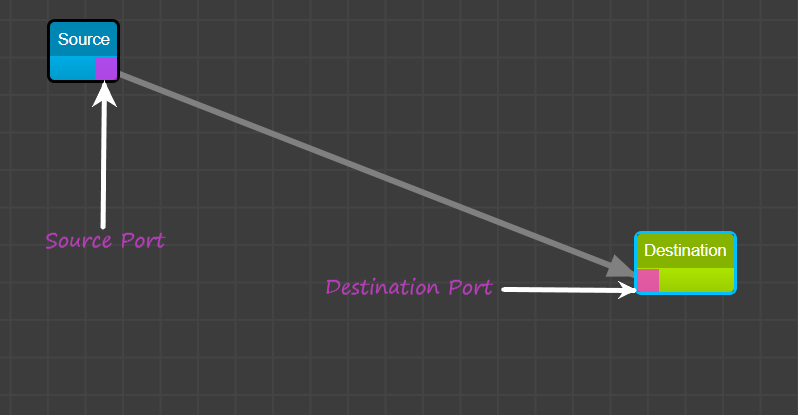
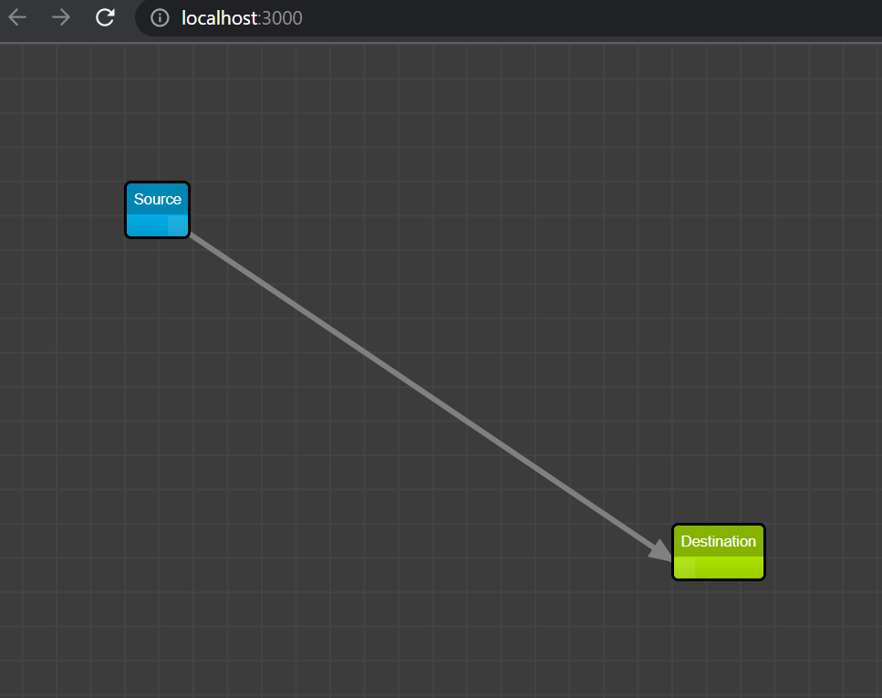

# Getting Started with UI Connector

This project was bootstrapped with [Create React App](https://github.com/facebook/create-react-app).

The project aims to configure a [UI connector](#homepage-snapshot) with the help of [`react-diagrams`](https://github.com/projectstorm/react-diagrams) npm package, and publishes the event details to the mock server, the mock server is used to make sure the codebase will work as planned while running on the real server.

## Project Details

The frontend is configured in React, while the mock backend server is running in Express. On the root page, there are two connectors labelled as "Source" and "Destination", there are ports as shown in the snapshot [here](#ui-port-snapshot) in the nodes from which one can add an new arrow link.

On every event change which includes the following:
- Change in element position
- Change in the node connecting links
- Change in selected/focused element

The following event listeners are registered but may not trigger currently, which includes the following events:
- Change in zoom
- Deletion of elements
- Addition of elements
- Change in offset
- Change of source port
- Change of target port

Furthermore, on every event change related to the link between the nodes, the frontend publishes the data to the mock server backend on the route `api/state/cache/`. A sample payload passed on to the request body by the use of JS `fetch` looks like
```sh
{
    "components": [
        {
            "id": "cef5c872-0226-4bd1-8994-92b573e24427",
            "name": "Source"
        },
        {
            "id": "fff92611-f811-47e8-8b77-163bac96460f",
            "name": "Destination"
        }
    ],
    "links": [
        {
            "src": "cef5c872-0226-4bd1-8994-92b573e24427",
            "dest": "fff92611-f811-47e8-8b77-163bac96460f"
        }
    ]
}
```

The server is running on port `8080`, to send requests from the front-end which is running on port `3000`, an `proxy` field is defined in the `package.json` with the value as `http://localhost:8080/`.
On a successful POST the server return with status code `204`.

### Installation

To get started with the project, follow the following steps:

1. Clone the repo
   ```sh
   git clone https://github.com/Dnouv/app-ui.git
   ```
2. Move to the project directory
   ```sh
   cd app-ui/app-ui
   ```
3. Install NPM packages
   ```sh
   npm install
   ```

## Available Scripts

In the project directory, you can run:

### `npm start`

Runs the app in the development mode.\
Open [http://localhost:3000](http://localhost:3000) to view it in your browser.

The page will reload when you make changes.\
You may also see any lint errors in the console.

### `npm test`

Launches the test runner in the interactive watch mode.\
See the section about [running tests](https://facebook.github.io/create-react-app/docs/running-tests) for more information.

### `npm run build`

Builds the app for production to the `build` folder.\
It correctly bundles React in production mode and optimizes the build for the best performance.

The build is minified and the filenames include the hashes.\
Your app is ready to be deployed!

See the section about [deployment](https://facebook.github.io/create-react-app/docs/deployment) for more information.

### `npm run eject`

**Note: this is a one-way operation. Once you `eject`, you can't go back!**

If you aren't satisfied with the build tool and configuration choices, you can `eject` at any time. This command will remove the single build dependency from your project.

Instead, it will copy all the configuration files and the transitive dependencies (webpack, Babel, ESLint, etc) right into your project so you have full control over them. All of the commands except `eject` will still work, but they will point to the copied scripts so you can tweak them. At this point you're on your own.

You don't have to ever use `eject`. The curated feature set is suitable for small and middle deployments, and you shouldn't feel obligated to use this feature. However we understand that this tool wouldn't be useful if you couldn't customize it when you are ready for it.

## Snapshots

#### UI Port snapshot

The port for the "Source" node is at the bottom-right corner from where the arrow link starts, as for the "Destination" node the port is at the bottom-left corner, where the arrow link ends.
<br />
<br />

#### Homepage snapshot

As seen in figure there are two UI nodes "Source" and "Destination" linked via a arrow line.

## Debugging

If the development stuck on `Starting the development server...`
try running
```sh
npm audit fix --force
````
(The error is caused due to version issues of react-scripts)

## License

Distributed under the Apache license.  See `LICENSE.txt` for more information.

## Documentation Accessibilty
To ensure the comfort and increase the accessibility of the documentation for every reader, the image on this `README.md` have alt text along with a paragraph about the details of image contents below every image used.

<br />

### Additional Details

Development OS: Ubuntu (Windows WSL)

Javascript version: ES6

create-react-version: 5.0.0

npm version: 7.5.4

